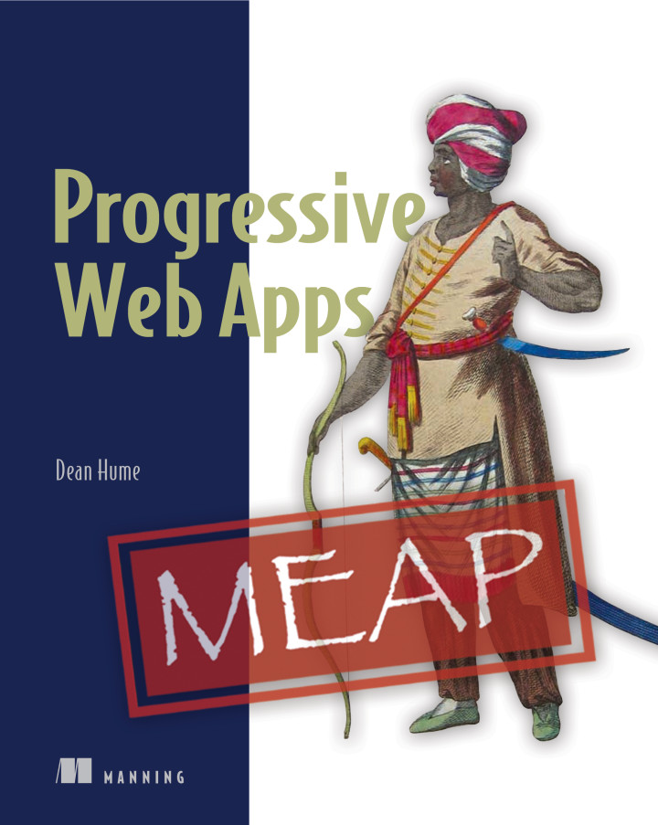

# [Progressive Web Apps (PWA)](https://www.manning.com/books/progressive-web-apps) 中文版

> ### 写在前面的话

> 首先要感谢 [Manning 出版社](https://www.manning.com/)和原书作者 [Dean Alan Hume](https://deanhume.com/) ！感谢他们的共同努力，带给大家一本如此之棒的 PWA 经典书籍。
> 其次本次译书纯属个人行为，未经有本书中文翻译版权的出版社授权。所以此中文版仅供大家学习使用，请勿用于任何商业用途。如果喜欢本书，请购买[正版图书](https://www.manning.com/books/progressive-web-apps)以支持原作者！感谢各位的配合！

> 本书通篇会将 `Progressive Web Apps` 直译成缩写形式 `PWA`，一方面是篇幅原因(名词过长)，另一方面由于译者偏好(将 PWA 进行到底)

本书一共12章，目前已经翻译校对了前6章。剩余6章将会持续更新，并会在第一时间发布出来，还请大家继续关注。

## 本书目录

- [x] [第1部分 | 定义 PWA](./Part1.md)
- [x] [第1章 | 理解 PWA](./ch01/README.md)
  - [x] [1.1 PWA 有什么优势？](./ch01/1.1.md)
  - [x] [1.2 Service Workers: PWA 的关键](./ch01/1.2.md)
  - [x] [1.3 性能洞察: Flipkart](./ch01/1.3.md)
  - [x] [1.4 总结](./ch01/1.4.md)
- [x] [第2章 | 构建 PWA 的第一步](./ch02/README.md)
  - [x] [2.1 建立在现有基础之上](./ch02/2.1.md)
  - [x] [2.2 构建 PWA 的前端架构方式](./ch02/2.2.md)
  - [x] [2.3 逐步剖析现有的 PWA](./ch02/2.3.md)
  - [x] [2.4 总结](./ch02/2.4.md)
- [x] [第2部分 | 更快的 Web 应用](./Part2.md)
- [x] [第3章 | 缓存](./ch03/README.md)
  - [x] [3.1 HTTP 缓存基础](./ch03/3.1.md)
  - [x] [3.2 Service Workers 缓存基础](./ch03/3.2.md)
  - [x] [3.3 缓存前后的性能比对](./ch03/3.3.md)
  - [x] [3.4 深入 Service Workers 缓存](./ch03/3.4.md)
  - [x] [3.5 总结](./ch03/3.5.md)
- [x] [第4章 | 拦截网络请求](./ch04/README.md)
  - [x] [4.1 Fetch API](./ch04/4.1.md)
  - [x] [4.2 Fetch 事件](./ch04/4.2.md)
  - [x] [4.3 Fetch 实战](./ch04/4.3.md)
  - [x] [4.4 总结](./ch04/4.4.md)
- [x] [第3部分 | 吸引人的 Web 应用](./Part3.md)
- [x] [第5章 | 外观感受](./ch05/README.md)
  - [x] [5.1 Web 应用清单](./ch05/5.1.md)
  - [x] [5.2 添加到主屏幕](./ch05/5.2.md)
  - [x] [5.3 添加到主屏幕的高级用法](./ch05/5.3.md)
  - [x] [5.4 调试清单文件](./ch05/5.4.md)
  - [x] [5.5 总结](./ch05/5.5.md)
- [x] [第6章 | 推送通知](./ch06/README.md)
  - [x] [6.1 与用户互动](./ch06/6.1.md)
  - [x] [6.2 参与度洞见: Weather Channel](./ch06/6.2.md)
  - [x] [6.3 浏览器支持](./ch06/6.3.md)
  - [x] [6.4 第一个推送通知](./ch06/6.4.md)
  - [x] [6.5 第三方推送通知](./ch06/6.5.md)
  - [x] [6.6 总结](./ch06/6.6.md)
- [ ] [第4部分 | 有弹性的 Web 应用](./Part4.md)
- [ ] [第7章 | 离线浏览](./ch07/README.md)
  - [ ] [7.1 解锁缓存](./ch07/7.1.md)
  - [ ] [7.2 几个需要注意的问题](./ch07/7.2.md)
  - [ ] [7.3 离线用户体验](./ch07/7.3.md)
  - [ ] [7.4 跟踪离线使用情况](./ch07/7.4.md)
  - [ ] [7.5 总结](./ch07/7.5.md)
- [ ] [第8章 | 构建更富弹性的应用](./ch08/README.md)
  - [ ] [8.1 现代网站所面临的网络问题](./ch08/8.1.md)
  - [ ] [8.2 Service Workers 来挽救](./ch08/8.2.md)
  - [ ] [8.3 总结](./ch08/8.3.md)
- [ ] [第9章 | 保持数据同步](./ch09/README.md)
  - [ ] [9.1 理解后台同步](./ch09/9.1.md)
  - [ ] [9.2 通知用户](./ch09/9.2.md)
  - [ ] [9.3 定期同步](./ch09/9.3.md)
  - [ ] [9.4 总结](./ch09/9.4.md)
- [ ] [第5部分 | PWA 的未来](./Part5.md)
- [ ] [第10章 | 流式数据](./ch10/README.md)
  - [ ] [10.1 理解 Web Streams](./ch10/10.1.md)
  - [ ] [10.2 基础示例](./ch10/10.2.md)
  - [ ] [10.3 页面渲染加速](./ch10/10.3.md)
  - [ ] [10.4 Web Stream API 的未来](./ch10/10.4.md)
  - [ ] [10.5 总结](./ch10/10.5.md)
- [ ] [第11章 | 前程似锦](./ch11/README.md)
  - [ ] [11.1 介绍](./ch11/11.1.md)
  - [ ] [11.2 Web 蓝牙技术](./ch11/11.2.md)
  - [ ] [11.3 Web 分享 API](./ch11/11.3.md)
  - [ ] [11.4 支付请求 API](./ch11/11.4.md)
  - [ ] [11.5 硬件访问](./ch11/11.5.md)
  - [ ] [11.6 硬件: 形状检测 API](./ch11/11.6.md)
  - [ ] [11.7 下一步呢？](./ch11/11.7.md)
  - [ ] [11.8 总结](./ch11/11.8.md)
- [ ] [第12章 | PWA 故障排除](./ch12/README.md)
  - [ ] [12.1 添加到主屏幕](./ch12/12.1.md)
  - [ ] [12.2 缓存](./ch12/12.2.md)
  - [ ] [12.3 调试 Service Worker 的具体问题](./ch12/12.3.md)
  - [ ] [12.4 总结](./ch12/12.4.md)

## 本书相关资源

* [PWA 官网](https://developers.google.com/web/progressive-web-apps/)
* [全书代码示例](https://github.com/deanhume/progressive-web-apps-book)
* [Let’s Encrypt](https://letsencrypt.org) - 免费的 HTTPS 证书授权
* [Lighthouse](https://github.com/GoogleChrome/lighthouse) - PWA 的审核、性能指标和最佳实践工具
* [webpagetest.org](https://www.webpagetest.org/) - 网站性能测试工具
* [Service Worker Toolbox](https://github.com/GoogleChromeLabs/sw-toolbox) - Service Worker 工具库
* [Manifest Validator](https://manifest-validator.appspot.com/) 清单文件验证工具
* [OneSignal](https://onesignal.com/) 第三方跨平台推送通知工具

## 参与贡献

由于个人水平有限，书中难免有纰漏及语句不通顺之处。还希望大家不吝赐教，多提宝贵意见或直接帮助我来完善本书的翻译，以给大家提供更好的阅读学习体验。