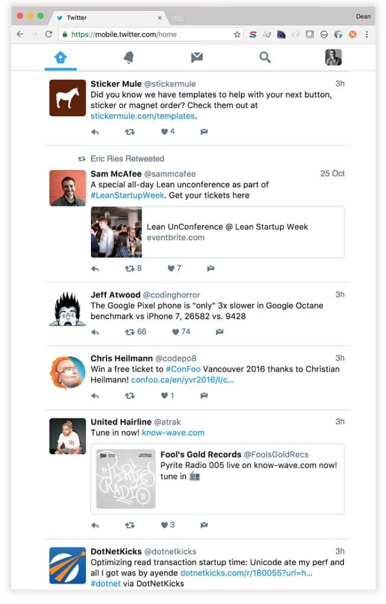
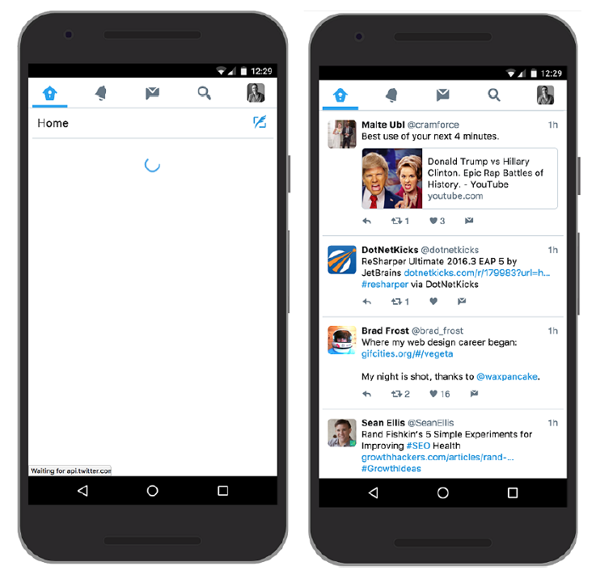
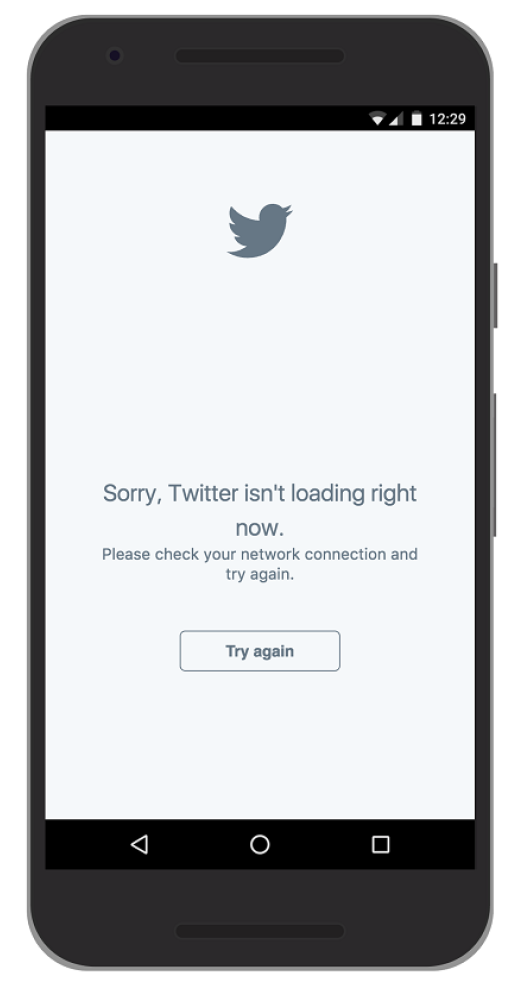

## 2.3 逐步剖析现有的 PWA

尽管 PWA 还是个比较新的概念，但已有一些了不起的 PWA 已经在网络上供每天数百万用户使用。

在下章中，我们会深入代码并向你展示如何开始构建自己的 PWA 。在我们更进一步之前，为了更好的理解 PWA 的这些功能是如何工作的，剖析现有的 PWA 还是有必要的。

在本节中，我们来看一个我个人非常喜欢的 PWA 。Twitter 的手机网站就是 PWA，它为使用移动设备的用户提供了增强体验。如果你使用 Twitter，那这是在旅途中查看推文的好方法。(参见图2.7)



**图2.7 Twitter 的手机网站就是 PWA，它采用了应用外壳架构**

如果在移动设备上导航到 twitter.com ， 会重定向到 mobile.twitter.com 并展现一个不同的网站。Twitter 将它们的 PWA 命名为 “Twitter Lite”，因为它占用的存储空间不到1MB，并声称可以节省多达70％的数据，同时加快30％的速度。

就个人而言，我觉得它非常棒，它应该还可以 PC 端使用！相对于原生版本，我实际上更喜欢 PWA 版本。你仍然可以在 PC 端上通过直接导航到mobile.twitter.com 来访问 Web 应用。

### 2.3.1 前端架构

在底层，Twitter Lite 是使用应用外壳架构构建的。这意味着它使用简单的 HTML 页面作为网站的 UI 外壳，而页面的主要内容是使用 JavaScript 动态注入的。如果用户的浏览器支持 Service Workers，那么 UI 外壳所需的所有资源都会在 Service Worker 安装阶段被缓存。



**图2.8 应用外壳架构立即赋予屏幕有意义的内容。左边的图片是用户首先看到的，一旦数据加载完成，就像右边图片那样呈现出数据。**

对于重复访客，这意味着外壳会瞬间加载并能够在没有任何延迟的情况下赋予屏幕有意义的内容。(参见图2.8) 对于不支持 Service Workers 的浏览器，此方法仍将以相同的方式工作，他们只是没有缓存 UI 外壳的资源， 并且会失去超快性能的附加奖励。Web 应用还针对使用响应式网页设计的不同屏幕尺寸进行了优化。

#### 缓存

Service Worker 缓存是一个强大的功能，它赋予我们这些 Web 开发者使用编程方式来缓存所需资源的能力。你能够拦截 HTTP 请求和响应，并根据你的需要调整它们。这个强大的功能是解锁更好的 Web 应用的关键。使用 Service Worker 允许你进入任何网络请求并完全由你来决定想要如何响应。

使用 Service Worker 缓存可以轻松完成快速、有弹性的 PWA 。Twitter Lite 很快，真的非常快。如果你在页面之间进行浏览，你会觉得这个 Web 应用非常好用，已缓存的页面几乎都是瞬时加载。作为用户，这种体验是我对于每一个网站的期望！

在底层，Twitter Lite 使用了一个叫做 Service Worker Toolbox 的库。这个库很方便，它包含一些使用 Service Workers 进行尝试并验证过的缓存技术。该工具箱为你提供了一些基本辅助方法，以便你开始创建自己的 Service Workers，并使你避免编写重复代码。在第3章中，我们将深入缓存，但目前我们还是先来看下使用 Service Worker Toolbox 的缓存示例。

##### 代码清单 2.1

```javascript
toolbox.router.get("/emoji/v2/svg/:icon", function(event) {                ❶
  return caches.open('twemoji').then(function(response) {                  ❷
    return response.match(event.request).then(function(response) {         ❸
      return response || fetch(event.request)                              ❹
    })
    }).catch(function() {
      return fetch(event.request)                                          ❺
    })
}, {
  origin: /abs.*\.twimg\.com$/                                             ❻
})
```

* ❶ 拦截路径为 '/emoji/v2/svg/:icon' 的任意请求
* ❷ 打开一个叫做 'twemoji' 的现有缓存
* ❸ 检查当前请求是否匹配我们缓存中的任何内容
* ❹ 如果匹配则立即返回缓存内容，否则继续正常运行
* ❺ 如果打开缓存时出现问题，只需继续正常运行
* ❻ 我们还想只检查 twimg.com 域名下的资源

在上面的代码清单2.1中，Service Worker Toolbox 寻找 URL 匹配'/emoji/v2/svg/' 并且来自 *.twimg.com 站点的任何请求。一旦它拦截了匹配此路由的任意 HTTP 请求，它会将它们存储在名为 'twemoji' 的缓存之中。等下次用户再次发起匹配此路由的请求时，呈现给用户的将是缓存的结果。

这段代码是非常强大的，它赋予我们这些开发者一种能力，使我们可以精准控制如何以及何时在网站上缓存资源。如果起初这段代码会让你有些困惑，也不要担心。在下章中，我们会深入 Service Worker 缓存并使用这个强大功能来构建页面。

#### 离线浏览

我每天上下班的途中都是在火车上度过的。很幸运，旅途不算太长，但不幸的是在某些区域网络信号很弱，甚至是掉线。这意味着如果我正在手机上浏览网页，有时我可能会失去连接，或者连接想当不稳定。这是相当令人沮丧的！

幸运的是，Service Worker 缓存是个强大的功能，它实际上是将网站资源保存到用户的设备上。这意味着使用 Service Workers 就可以让你拦截任何 HTTP 请求并直接用设备上缓存的资源进行响应。你甚至不需要访问网络就可以获取缓存的资源。

考虑到这一点，我们可以使用这些功能来构建离线页面。使用 Service Worker 缓存，你可以缓存个别的资源，甚至是整个网页，这完全取决于你。如果用户没有网络连接，Twitter Lite 会为用户展现一个自定义的离线页面。



**图2.9 如果用户没有网络连接，Twitter PWA 会为用户显示一个自定义的错误页面。**

用户现在看到的是一个有帮助的自定义离线页面，而不是可怕的错误: “无法访问此网站” (参见图2.9)。他们还可以通过点击提供的按钮来检查连接是否恢复。对于用户来说，这种 Web 体验更好。在第8章中，你将掌握开始构建自己的离线页面所需的必要技能，并为你的用户提供富有弹性的浏览体验。

#### 外观感受

Twitter Lite 很快，而且针对小屏幕进行了优化，还能离线工作。还有什么？好吧，它需要如同原生应用一样的外观感受！如果你仔细查看过 Web 应用主页的 HTML 的话，可能会注意到下面这行代码：

```html
<link rel="manifest" href="/manifest.json">
```

这个链接指向一个被称为“清单文件”的文件。这个文件只是简单的 JSON 文件，它遵循 W3C 的 Web App Manifest 规范，并使开发者能够控制应用中不同元素的外观感觉。它提供 Web 应用的信息，比如名称，作者，图标和描述。

它带来了一些好处。首先，它使浏览器能够将 Web 应用安装到设备的主屏幕，以便为用户提供更快捷的访问和更丰富的体验。其次，通过在清单文件中设置品牌颜色，你可以自定义浏览器自动显示的启动画面。它还允许你自定义浏览器的地址栏以匹配你的品牌颜色。

使用清单文件真正地使 Web 应用的外观感觉更加完美，并为你的用户提供了更丰富的体验。Twitter Lite 使用清单文件以利用浏览器中的许多内置功能。

在第5章中，我们会探索如何使用清单文件来增强 PWA 的外观感受，并为用户提供有吸引力的浏览体验。

#### 最终产品

Twitter Lite 是一个全面的例子，它很好地诠释了 PWA 应该是怎样的。它涵盖了贯穿本书的绝大部分功能，这些功能都是为了构建一个快速、有吸引力和可靠的 Web 应用。

在第1章中，我们讨论过了 Web 应用应该具备的所有功能。让我们来回顾下到目前为止 Twitter PWA 的细节。该应用是:

  * **响应式的** - 它适应较小的屏幕尺寸
  * **连接无关** - 由于 Service Worker 缓存，它可以离线工作
  * **应用式的交互** - 它使用应用外壳架构进行构建
  * **始终保持最新** - 感谢 Service Worker 的更新过程
  * **安全的** - 它通过 HTTPS 进行工作
  * **可发现的** - 搜索引擎可以找到它
  * **可安装的** - 使用清单文件
  * **可链接的** - 可以简单的通过 URL 来共享

哇！真是个大清单，但幸运的是我们所得到的这些收益不少都是构建 PWA 的附属品。