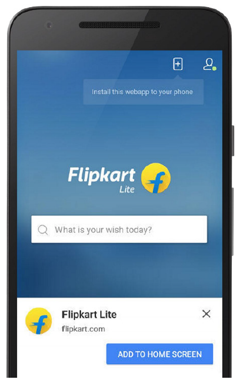
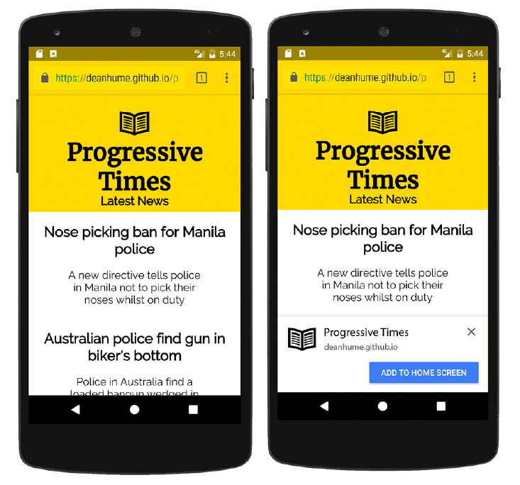
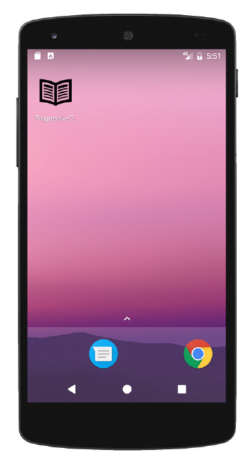
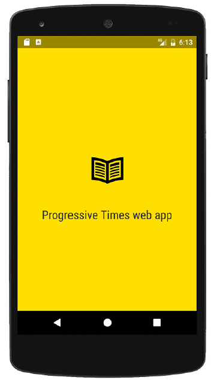

## 5.2 添加到主屏幕

当我在忙时，并且需要快速访问应用，只需打开主屏幕，轻按一下图标就可以立即打开。对于设备上已安装的原生应用来说，这种行为几乎是默认的。作为 Web 开发者，如果我们想要吸引用户并能让他们经常来浏览，我们需要同样的功能！ 这是“添加到主屏幕”功能诞生的原因。

添加到主屏幕，也称为 “Web 应用安装操作栏”，这是一种允许用户在浏览器中快速无缝地将 Web 应用添加到主屏幕的绝佳方法。为了确保用户可以快速地访问网站，此功能会显示提示，询问用户是否要将 Web 应用添加到主屏幕。如果用户接受，一个图标会被添加设备的主屏幕上，此图标引用了应用的 URL 。此后访问 Web 应用只需手指轻轻一按。



**图5.2 添加到主屏幕功能是与用户互动并让他们经常浏览的好方法**

在本书的第1章中，我们看过了印度一家公司 Flipkart 以及他们是如何构建名为 Flipkart Lite 的 PWA 的。Flipkart 想要他们的移动用户享受不逊色于原生应用的用户体验。通过使用添加到主屏幕功能，Flipkart Lite 所有访问的60％均来自主屏幕图标启动。这项功能还意味着他们的客户转化率提升了70%。仅这两项活动就使参与人数比以前高了40%!



**图5.3 使用正确的代码，会提示用户是否将你的 Web 应用添加到主屏幕**

在图5.3中，你可以看到当用户单击主屏幕上的图标时发生的不同步骤。在左侧，你可以看到主屏幕上的图标。当用户点击它时，它们将在页面加载时显示启动页面。最后，根据清单文件中定义的设置，Web 应用将会呈现。( 译者注: 这段感觉图文不符 或者是我没领悟:< )

从开发者的角度来看，添加到主屏幕功能最棒的是几乎不用写任何代码便可实现功能，浏览器已经为你做好了这一切。

在你过于激动之前，还需要知道在显示“添加到主屏幕”提示之前，需要满足几个条件:

  1. 需要 manifest.json 文件
  2. 清单文件需要启动 URL
  3. 需要 144x144 的 PNG 图标
  4. 网站正在使用通过 HTTPS 运行的 Service Worker
  5. 用户需要至少浏览网站两次，并且两次访问间隔在五分钟之上

上述条件中，第5点或许是最重要的。用户至少访问过网站两次并且两次之间的间隔在五分钟之上，提示才会出现，这样做的原因是为了确保这项功能不会让人反感。想像一下，如果你访问过的每个网站都使用了这项技术，并且每个页面都会提示“添加到主屏幕”？它很快就会变得令人反感，而 浏览器厂商也会发现自己在作茧自缚！

这个功能也是浏览器内置的，这意味着你无法控制上述条件。然而，随着本章的学习，你将学习到不同的技术，可使你对提示出现的时间和方式进行微调控制。

### 5.2.1 定制图标

用户被提示是否添加 Web 应用到主屏幕并且接受后，他们首先看到的就是出现在主屏幕的图标。把这项配置添加到 manifest.json 文件中很容易，如清单5.3所示。

##### 代码清单 5.3

```json
"icons": [
  {
    "src": "homescreen.png",
    "sizes": "144x144",
    "type": "image/png"
  }
```

为简洁起见，在清单5.3中，我简化了清单文件中的代码，只显示 `icons` 的部分。你可以在 icons 数组中提供不同尺寸的图标列表，这些图标可以在各种环境中使用，并根据设备显示不同的图标。例如，它们可用于在其他应用的列表中代表该 Web 应用，或将 Web 应用于 OS 的任务切换器或系统偏好进行集成。


**图5.4 使用清单文件来定制 Web 应用意味着它可以与操作系统集成以提供真正的“应用式”的感觉**

在我们的示例应用 Progressive Times 中，我已经添加了清单文件并引用了一个安装在主屏幕上的图标。你可以在 [bit.ly/chapter-pwa-5](bit.ly/chapter-pwa-5) 找到所有代码。一旦安装完成，该图标应该出现在用户设备的主屏幕上，如图5.5所示。



**图5.5 主屏幕上显示的图标与 Web 应用清单文件中的图标相匹配**

### 5.2.2 添加启动页面

当用户点击主屏幕上的 Web 应用，浏览器渲染页面的第一帧时，将显示一个临时的“启动页面”。启动页面旨在提高网站加载的感知性能，并可帮助用户感觉网站的加载速度比实际速度要快一些。清单文件准备好后，绝大部分功能都是即开即用的。清单5.4提供了你所需的基础代码。

##### 代码清单 5.4

```json
"name": "Progressive Times web app",
"theme_color": "#FFDF00",
"background_color": "#FFDF00",       ❶
"icons": [{
  "src": "homescreen.png",
  "sizes": "192x192",
  "type": "image/png"
}]
```

* ❶ name 和 background_color 属性用来显示启动页面

启动页面是根据清单文件中的信息动态生成的。它使用了 `name` 和 `background_color` 两个属性，以及浏览器根据在 `icons` 数组中选择尺寸最合适的图标。

使用清单5.4中的代码，你应该注意到启动页面类似于下图。



**图5.6 启动页面使用 name 和 background_color 这两个属性来设计它的外观**

### 5.2.2 设置启动样式和 URL

最后，为了给添加到主屏幕功能锦上添花，你需要设置显示模式和启动 URL 。显示模式决定了你想如何在用户的设备上呈现你的 Web 应用，启动 URL 是用户点击主屏幕图标时将登陆的第一个页面。

这两个值都在清单文件中定义。

##### 代码清单 5.5

```json
"start_url": "/index.html",
"display": "standalone",
```

在清单5.5中，`start_url` 用来指定当用户从设备启动应用时加载的 URL 。如果给定的是相对路径，那么基础路径就是清单的路径。如果你想追踪有多少人是通过主屏幕图标访问网站的，你可能想要在查询字符串中追加追踪代码，比如 `/index.html?homescreen=1` 这样的 URL 。这样一来，你的 Web 分析软件包就可以分辨出通过主屏幕图标到达的用户。

关于 Web 应用如何显示在用户的设备上，还有几个不同的选项。例如，你可以选择最符合需求的显示模式。显示模式表示 Web 应用在操作系统环境中的展现方式: fullscreen、standalone、minimal-ui 或 browser 。

每种显示模式对 Web 应用的影响如下:

  * **Fullscreen** - 打开 Web 应用并占用整个可用的显示区域。
  * **Standalone** - 打开 Web 应用以看起来像一个独立的原生应用。此模式下，用户代理将排除诸如 URL 栏等标准浏览器 UI 元素，但可以包括诸如状态栏和系统返回按钮的其他系统 UI 元素。
  * **Minimal-ui** - 此模式类似于 fullscreen，但为终端用户提供了可访问的最小 UI 元素集合，例如，后退按钮、前进按钮、重载按钮以及查看网页地址的一些方式。
  * **Browser** - 使用操作系统内置的标准浏览器来打开 Web 应用。

在 Web 应用清单中，display 属性是可选项，默认它会以 browser 模式来显示。这些不同的显示模式为开发者开辟了一个充满可能性的世界，重要的是你想要 Web 应用以何种方式出现。例如，如果你的 Web 应用是游戏，使用 `standalone` 显示模式更适合，以确保 Web 应用用起来更身临其境。如果你的 Web 应用是在线出版物，你可能会选择 `minimal-ui` 或 `fullscreen` 显示模式，以确保专注于文本而消除干扰。完全在于你的掌控，但要记住无论选择哪种风格都会影响 Web 应用的感受，所以请做出明智的选择！
